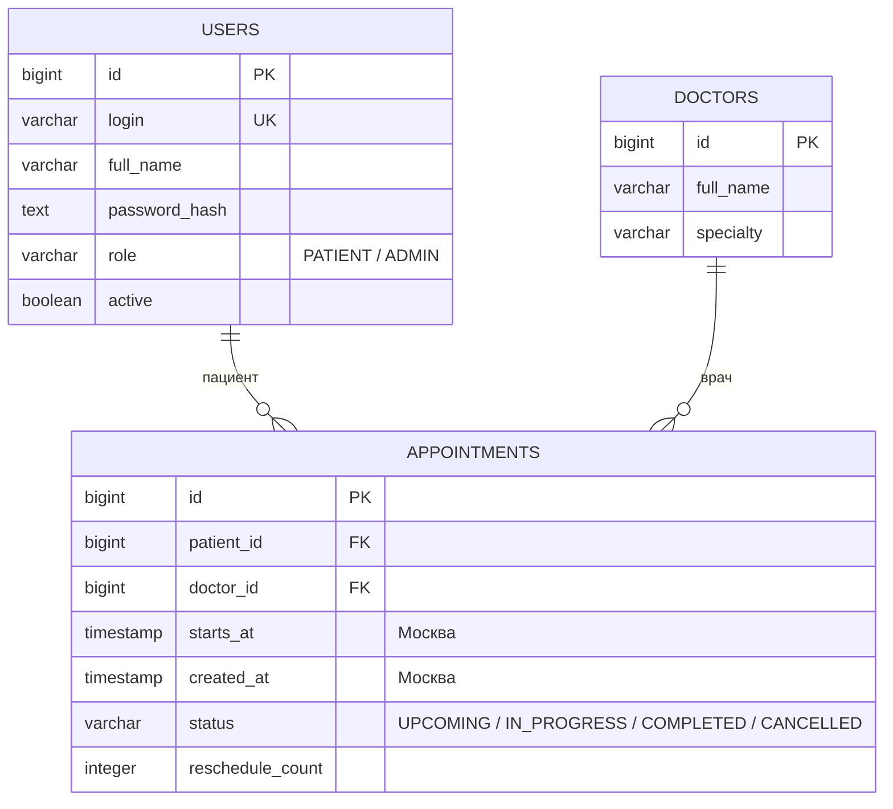

# ER-диаграмма

Все поля обязательны. `login` уникален. У врача уникальна пара «ФИО + специальность». Для записей действуют два частичных уникальных индекса: `(doctor_id, starts_at)` и `(patient_id, starts_at)` при `status <> 'CANCELLED'`. Отменённые записи остаются в истории, освобождая слот. FK запрещают удалять пользователя/врача со связанными записями.

`ADMIN` и `PATIENT` — роли учётной записи, а не разные таблицы. Врач — отдельная сущность справочника и в этой версии не входит в программу. `reschedule_count` позволяет учитывать переносы без дополнительного статуса.
